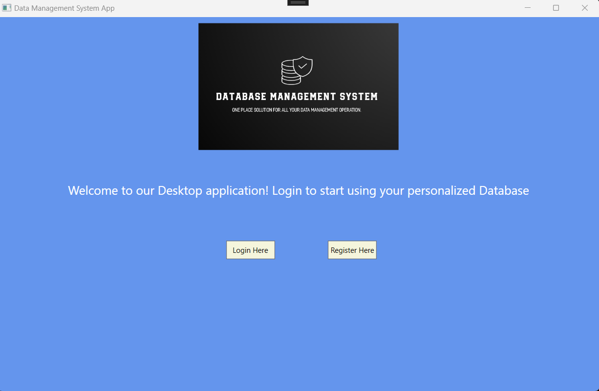
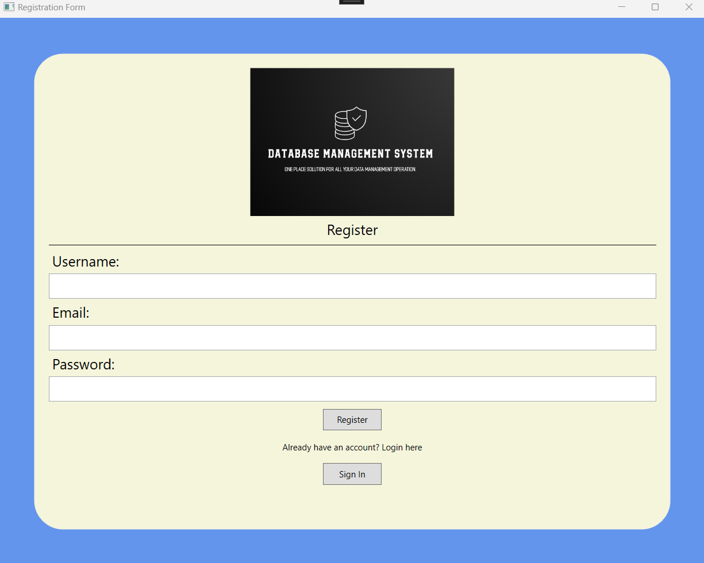

# DBMS_WPF_App

This is a C# WPF application, based on the DATABASE MANAGEMENT SYSTEM PROJECT. It is meant to be a PC Desktop application that works just as its web version. 
This is the first release and only the user Authentication with an SQL database is functional.
Second Release: Data-Binding table with functional CRUD operations.

## Screenshots

## Authors

- [@ItalCad91](https://tinyurl.com/RRsystemPortfolio)

## License

©️RRSystems 2023
