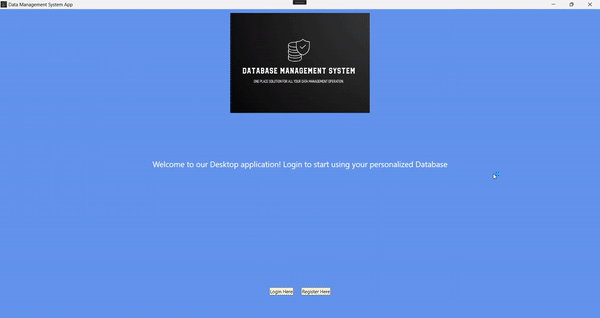

# DBMS_WPF_App

This is a C# WPF application based on DATABASE MANAGEMENT SYSTEM PROJECT. The desktop version includes the same full CRUD functionality as the web version, and the installer folder includes the executable for distribution.

## Demo

## Screenshots

  

## Authors

- [@ItalCad91](https://tinyurl.com/RRsystemPortfolio)

## License

©️RRSystems 2023
"# DBMS_WindowsWPF_App" 
