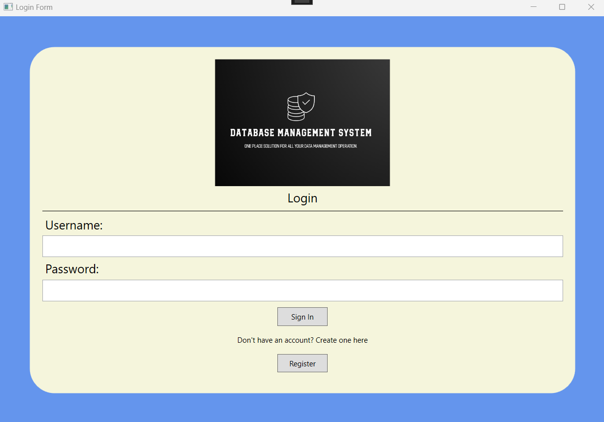

# DBMS_WPF_App

This is a C# WPF application, based on the DATABASE MANAGEMENT SYSTEM PROJECT. It is meant to be a PC Desktop application that works just as its web version. 

## Demo

## Screenshots

  

## Authors

- [@ItalCad91](https://tinyurl.com/RRsystemPortfolio)

## License

©️RRSystems 2023
"# DBMS_WindowsWPF_App" 
